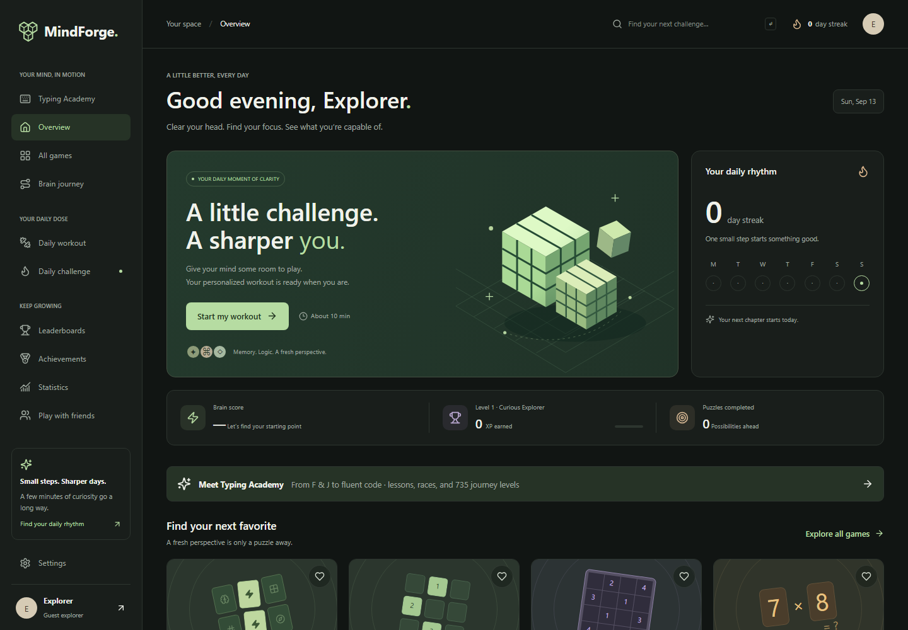
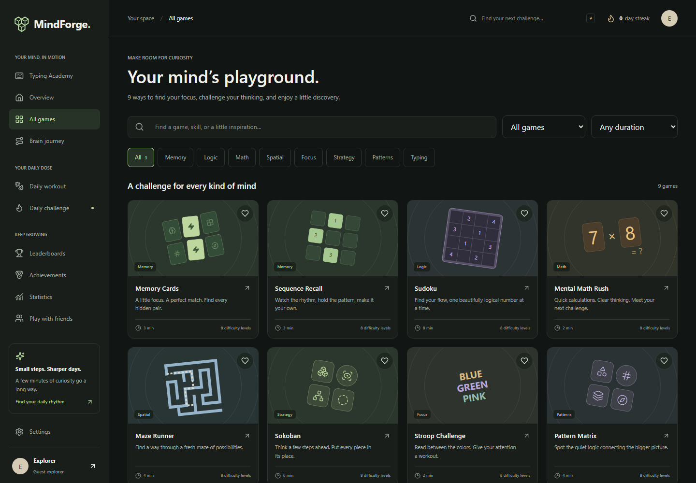
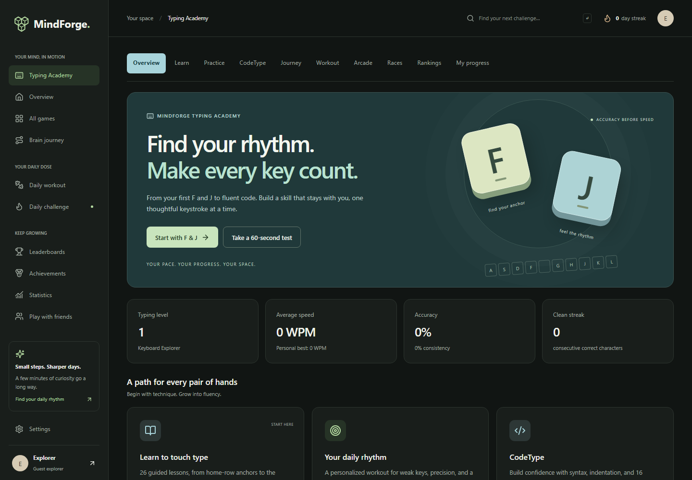
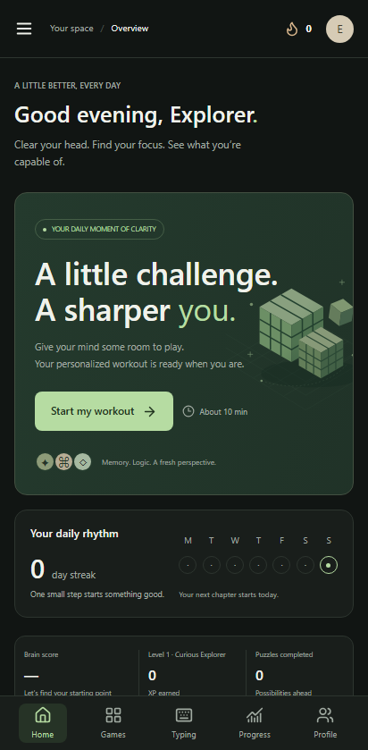

# MindForge

MindForge is a responsive puzzle and mental-exercise web app built with React, TypeScript and an Express API. Guest play works locally; connected accounts use PostgreSQL and server-validated game replays. Scores describe performance in MindForge games and are not medical assessments.

The initial playable set is Memory Cards, Sequence Recall, Sudoku, Mental Math Rush, Maze Runner, Sokoban, Stroop Challenge and Pattern Matrix. The project brief describes a larger future catalogue; see [release status](docs/RELEASE_STATUS.md) for what is implemented and what still needs live-service work.

## Screenshots

Screenshots from the local development app with a fresh guest profile.

### Dashboard



### Game library



### Typing Academy



### Mobile



## Run locally

Use Node.js 24 and npm. Install the locked dependencies:

```sh
npm ci
npm run db:generate
```

Start guest play at <http://localhost:5173>:

```sh
npm run dev
```

For a disposable local account service, copy `.env.example` to `.env`, set `MEMORY_DATABASE=true`, and run:

```sh
npm run dev:all
```

That explicit development mode stores account records in API process memory. Restarting the API clears those records. Browser guest progress is saved separately in local storage.

For persistent accounts, keep `MEMORY_DATABASE=false`, point `DATABASE_URL` in `.env` at PostgreSQL, then run:

```sh
npx prisma migrate deploy
npm run db:seed
npm run dev:all
```

The API listens on port 3001. Vite forwards `/api` to it so the browser uses one origin. The seed creates catalogue and progression definitions, never fake players, passwords, scores or leaderboard entries.

## Run the container stack

With Docker Engine and Docker Compose installed:

1. Copy `.env.example` to `.env`.
2. Run `docker compose up --build --wait`.
3. Open <http://localhost:8080>.

Compose starts PostgreSQL, applies checked-in migrations and seed data, starts the API, and serves the web build through nginx. PostgreSQL data lives in a named volume. The default stack is local HTTP development; [deployment instructions](docs/DEPLOYMENT.md) cover production HTTPS and secrets. Docker was not available on the authoring machine; the CI container job is configured to exercise this stack.

## Check the project

```sh
npm run lint
npm run typecheck
npm test
npm run build
npx playwright install chromium
npm run test:e2e
```

Playwright launches the built frontend on port 4173 and an isolated memory API on port 3001. Keep these ports free. Tests run against desktop and mobile Chromium. The CI workflow also defines a Docker/PostgreSQL deployment smoke test. A configured workflow is not evidence that a hosted CI run or deployment has succeeded.

## Documentation

- [Architecture](docs/ARCHITECTURE.md)
- [Game engine and adding games](docs/GAME_ENGINE.md)
- [Database and migrations](docs/DATABASE.md)
- [API](docs/API.md)
- [Development and verification](docs/DEVELOPMENT.md)
- [Deployment and operations](docs/DEPLOYMENT.md)
- [Contributing](docs/CONTRIBUTING.md)
- [Release status and limitations](docs/RELEASE_STATUS.md)

The original scope is preserved in `MindForge — Advanced Codex Master Development Prompt.md`, with implementation sequencing in `PLAN.md`.
